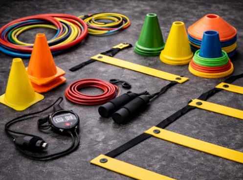
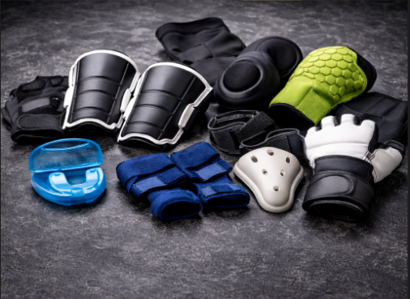

# 📋 MAPEO COMPLETO DEL CÓDIGO - wear-deportes.html

---

## 🎯 ESTRUCTURA GENERAL DEL DOCUMENTO

```
wear-deportes.html (Página principal - Distribuidora Mayorista Deportiva)
├── HEAD (Configuración y recursos)
├── BODY
│   ├── MOBILE MENU
│   ├── NAVBAR (Navegación)
│   ├── HERO CAROUSEL (3 slides principales)
│   ├── TICKER (Información repetitiva)
│   ├── SECCIONES PRINCIPALES
│   ├── FOOTER
│   ├── WA FLOAT (Botón WhatsApp flotante)
│   └── SCRIPTS (JavaScript)
```

---

## 📝 SECCIÓN 1: HEAD (Líneas 1-10)

### Propósito
Configuración del documento HTML y carga de recursos externos.

### Contenido
```html
<!DOCTYPE html>
<html lang="es">
<head>
  <meta charset="UTF-8"/> <!-- Codificación caracteres latinos -->
  <meta name="viewport" content="width=device-width, initial-scale=1.0"/> <!-- Responsive -->
  <title>Wear Deportes — Distribuidora Mayorista</title> <!-- Título navegador -->
  
  <!-- FUENTES GOOGLE -->
  <link href="https://fonts.googleapis.com/css2?family=Barlow+Condensed:ital,wght@0,300;0,400;0,600;0,700;0,800;0,900;1,800&family=Barlow:wght@300;400;500;600;700&display=swap" rel="stylesheet"/>
  
  <!-- BOOTSTRAP CSS (CDN) -->
  <link href="https://cdn.jsdelivr.net/npm/bootstrap@5.3.3/dist/css/bootstrap.min.css" rel="stylesheet"/>
  
  <!-- BOOTSTRAP ICONS -->
  <link href="https://cdn.jsdelivr.net/npm/bootstrap-icons@1.11.3/font/bootstrap-icons.css" rel="stylesheet"/>
  
  <!-- CSS PERSONALIZADO -->
  <link rel="stylesheet" href="css/deporte.css">
</head>
```

### Recursos Cargados
- **Fuentes**: Barlow (tipografía moderna)
- **Framework**: Bootstrap 5.3.3
- **Iconos**: Bootstrap Icons
- **Estilos**: archivo local `deporte.css`

---

## 📱 SECCIÓN 2: MOBILE MENU (Líneas 13-23)

### Propósito
Menú móvil que aparece en pantallas pequeñas. Se abre/cierra con botón hamburguesa.

### HTML
```html
<div class="mobile-menu" id="mobMenu">
  <button class="mob-close" onclick="closeMob()">
    <i class="bi bi-x-lg"></i> <!-- Ícono cerrar (X) -->
  </button>
  <!-- Enlaces internos -->
  <a href="#nosotros" onclick="closeMob()">Nosotros</a>
  <a href="#categorias" onclick="closeMob()">Categorías</a>
  <a href="#productos" onclick="closeMob()">Productos</a>
  <a href="#marcas" onclick="closeMob()">Marcas</a>
  <a href="#proceso" onclick="closeMob()">Cómo Comprar</a>
  <a href="#testimonios" onclick="closeMob()">Clientes</a>
  
  <!-- Enlace WhatsApp (verde) -->
  <a href="https://wa.me/51922235453?text=Hola%20Wear%20Deportes%2C%20quiero%20hacer%20un%20pedido%20mayorista" 
     target="_blank" style="color:var(--wa)">
    <i class="bi bi-whatsapp me-2"></i>WhatsApp
  </a>
</div>
```

### Funciones Relacionadas
- `closeMob()`: Cierra el menú móvil

---

## 🔝 SECCIÓN 3: NAVBAR (Líneas 25-51)

### Propósito
Barra de navegación fija con logo y menú principal.

### Estructura
```html
<nav id="nav"> <!-- Barra de navegación principal -->
  <div class="nav-wrap">
    
    <!-- LOGO (SVG animado) -->
    <a href="#"> <!-- Logo clickeable -->
      <svg height="44" viewBox="0 0 290 80">
        <!-- Círculos decorativos con trazo -->
        <circle cx="36" cy="36" r="31" fill="none" stroke="#d62828"/>
        <!-- Polilínea de chevron/montaña -->
        <polyline points="18,27 27,50 36,34 45,50 54,27"/>
        <!-- Texto "WEAR" -->
        <text font-weight="900">WEAR</text>
        <!-- Círculo separador rojo -->
        <circle cx="190" cy="42" r="3.5" fill="#d62828"/>
        <!-- Texto "DEPORTES" -->
        <text font-weight="700" fill="#d62828">DEPORTES</text>
        <!-- Tagline en itálica -->
        <text font-style="italic">— Pasión por el Deporte —</text>
      </svg>
    </a>
    
    <!-- MENÚ PRINCIPAL (visible en desktop) -->
    <ul class="nav-links">
      <li><a href="#nosotros">Nosotros</a></li>
      <li><a href="#categorias">Categorías</a></li>
      <li><a href="#productos">Productos</a></li>
      <li><a href="#marcas">Marcas</a></li>
      <li><a href="#proceso">Cómo Comprar</a></li>
      <li><a href="#testimonios">Clientes</a></li>
      <li><a href="https://wa.me/..." class="nav-wa">
        <i class="bi bi-whatsapp"></i>WhatsApp
      </a></li>
    </ul>
    
    <!-- BOTÓN HAMBURGUESA (mostrar en mobile) -->
    <button class="hamburger" onclick="openMob()">
      <span></span><span></span><span></span>
    </button>
  </div>
</nav>
```

### Funciones Relacionadas
- `openMob()`: Abre menú móvil

---

## 🎠 SECCIÓN 4: HERO CAROUSEL (Líneas 53-175)

### Propósito
Carrusel principal con 3 slides anunciando servicios principales. Rota automáticamente cada 5.5 segundos.

### Estructura General
```html
<div id="heroC" class="carousel slide carousel-fade" 
     data-bs-ride="carousel" data-bs-interval="5500">
  <!-- Indicadores (puntitos) -->
  <div class="carousel-indicators">
    <button data-bs-target="#heroC" data-bs-slide-to="0" class="active"></button>
    <button data-bs-target="#heroC" data-bs-slide-to="1"></button>
    <button data-bs-target="#heroC" data-bs-slide-to="2"></button>
  </div>
  
  <!-- Contenido slides -->
  <div class="carousel-inner">
    <!-- SLIDE 1 -->
    <!-- SLIDE 2 -->
    <!-- SLIDE 3 -->
  </div>
  
  <!-- Controles anterior/siguiente -->
  <button class="carousel-control-prev">...</button>
  <button class="carousel-control-next">...</button>
</div>
```

### SLIDE 1: VENDE MÁS (Líneas 63-88)
```html
<div class="carousel-item active">
  <div class="hslide hbg1"> <!-- Fondo 1 -->
    <div class="hgrid"></div> <!-- Cuadrícula decorativa -->
    <div class="hline"></div> <!-- Línea decorativa -->
    
    <div class="container hcontent">
      <div class="eyebrow">Distribuidora Mayorista · Temporada 2025</div>
      
      <h1 class="htitle">
        VENDE<br>
        <span class="tred">MÁS.</span><br>
        <span class="tgray">COMPRA MEJOR.</span>
      </h1>
      
      <p class="hbody">Accedé a los mejores precios mayoristas...</p>
      
      <!-- CTA Buttons -->
      <div class="hctas">
        <a href="https://wa.me/..." class="btn-red">
          <i class="bi bi-whatsapp"></i>Ver Catálogo
        </a>
        <a href="#nosotros" class="btn-outline-wh">
          Conocenos <i class="bi bi-arrow-right"></i>
        </a>
      </div>
    </div>
    
    <div class="hbignum">WEAR</div> <!-- Número grande fondo -->
  </div>
</div>
```

### SLIDE 2: ROPA DEPORTIVA (Líneas 90-114)
- Enfoque: Ropa deportiva mayorista
- CTA: "Consultar Precios"
- Número fondo: "SPORT"

### SLIDE 3: TU NEGOCIO EMPIEZA AQUÍ (Líneas 116-140)
- Enfoque: Para emprendedores
- CTA: "Soy Emprendedor"
- Número fondo: "MAYOR"

---

## 📢 SECCIÓN 5: TICKER (Líneas 142-159)

### Propósito
Barra de desplazamiento horizontal con información repetitiva (animación infinita).

### HTML
```html
<div class="ticker">
  <div class="ticker-in">
    <span class="tick-item">
      <span class="tick-sep"></span>DISTRIBUIDORA MAYORISTA
    </span>
    <span class="tick-item">
      <span class="tick-sep"></span>EQUIPAMIENTO DEPORTIVO
    </span>
    <span class="tick-item">
      <span class="tick-sep"></span>STOCK PERMANENTE
    </span>
    <span class="tick-item">
      <span class="tick-sep"></span>ENVÍOS A TODO EL PAÍS
    </span>
    <span class="tick-item">
      <span class="tick-sep"></span>PEDIDOS POR WHATSAPP
    </span>
    <span class="tick-item">
      <span class="tick-sep"></span>PRECIOS MAYORISTAS
    </span>
    <!-- Items repetidos para efecto infinito -->
  </div>
</div>
```

### Características
- Texto repetido para crear efecto de loop infinito
- Separadores visuales entre items
- Animación CSS (sin JavaScript)

---

## 👥 SECCIÓN 6: QUIÉNES SOMOS (Líneas 161-207)

### Propósito
Sección informativa sobre la empresa. ID: `#nosotros`

### Estructura
```html
<section class="sp" id="nosotros" style="background:var(--black2);scroll-margin-top:72px;">
  <div class="container">
    <!-- 2 columnas: Texto + Imagen -->
    <div class="row align-items-center g-5">
      
      <!-- COLUMNA IZQUIERDA: CONTENIDO -->
      <div class="col-lg-6">
        <div class="eyebrow">Quiénes somos</div> <!-- Etiqueta pequeña -->
        
        <h2 class="stitle">
          SOMOS TU<br>DISTRIBUIDORA<br><span class="tr">DE CONFIANZA</span>
        </h2> <!-- Título principal -->
        
        <div class="divr mb-4"></div> <!-- Línea decorativa roja -->
        
        <!-- Párrafo descriptivo -->
        <p style="color:rgba(255,255,255,.5);...">
          Wear Deportes es una distribuidora mayorista...
        </p>
        
        <!-- ESTADÍSTICAS -->
        <div class="row g-4 mb-4">
          <div class="col-6">
            <div class="about-statbox">
              <div class="about-num">6+</div>
              <div class="about-lbl">Años en el rubro</div>
            </div>
          </div>
          <div class="col-6">
            <div class="about-statbox">
              <div class="about-num">500+</div>
              <div class="about-lbl">Productos activos</div>
            </div>
          </div>
          <div class="col-6">
            <div class="about-statbox">
              <div class="about-num">200+</div>
              <div class="about-lbl">Clientes activos</div>
            </div>
          </div>
          <div class="col-6">
            <div class="about-statbox">
              <div class="about-num">15</div>
              <div class="about-lbl">Marcas distribuidas</div>
            </div>
          </div>
        </div>
        
        <!-- CARACTERÍSTICAS (chips) -->
        <div>
          <span class="feature-chip">
            <i class="bi bi-check-circle-fill"></i>Stock Garantizado
          </span>
          <span class="feature-chip">
            <i class="bi bi-check-circle-fill"></i>Precios Diferenciados
          </span>
          <span class="feature-chip">
            <i class="bi bi-check-circle-fill"></i>Envío Nacional
          </span>
          <span class="feature-chip">
            <i class="bi bi-check-circle-fill"></i>Atención Directa
          </span>
        </div>
      </div>
      
      <!-- COLUMNA DERECHA: IMAGEN -->
      <div class="col-lg-6">
        <div class="about-img">
          <div class="about-img-bg"></div> <!-- Fondo decorativo -->
          <div class="about-img-text">WEAR<br>DEPORTES</div> <!-- Texto sobreimpreso -->
          <div class="about-badge">
            <strong>6</strong>AÑOS<br>DE EXPERIENCIA
          </div> <!-- Badge esquina -->
        </div>
      </div>
    </div>
  </div>
</section>
```

---

## 🏷️ SECCIÓN 7: CATEGORÍAS (Líneas 209-283)

### Propósito
Muestra 4 categorías de productos principales. ID: `#categorias`

### Estructura
```html
<section class="sp" id="categorias" style="background:var(--black2);scroll-margin-top:72px;">
  <div class="container">
    <!-- Encabezado -->
    <div class="row mb-5 align-items-end">
      <div class="col-lg-7">
        <div class="eyebrow">Nuestro </div>
        <h2 class="stitle">CATEGORÍAS<br>PRINCIPALES</h2>
        <div class="divr"></div>
      </div>
      <div class="col-lg-5 text-lg-end">
        <p style="color:rgba(255,255,255,.35);">
          Tocá cualquier categoría para consultar<br>precios y disponibilidad por WhatsApp
        </p>
      </div>
    </div>
    
    <!-- GRID 4 COLUMNAS -->
    <div class="row g-3">
      
      <!-- TARJETA CATEGORÍA 1: PELOTAS -->
      <div class="col-md-6 col-lg-3">
        <div class="cat-card">
          <div class="cat-bg-layer cbg1"></div> <!-- Fondo color -->
          <div class="cat-icon">
            
          </div> <!-- Imagen producto -->
          <div class="cat-overlay-grad"></div> <!-- Overlay gradiente -->
          <div class="cat-info">
            <span class="cat-min">Mín. 3 u.</span> <!-- Mínimo pedido -->
            <h3>Pelotas<br></h3> <!-- Nombre categoría -->
            <p>Pelotas para diferentes deportes...</p> <!-- Descripción -->
            <a href="https://wa.me/..." class="btn-wa-cat">
              <i class="bi bi-whatsapp"></i>Consultar
            </a> <!-- Botón WhatsApp -->
          </div>
        </div>
      </div>
      
      <!-- TARJETA CATEGORÍA 2: ACCESORIOS -->
      <div class="col-md-6 col-lg-3">
        <div class="cat-card">
          <div class="cat-bg-layer cbg2"></div>
          <div class="cat-icon">
            
          </div>
          <div class="cat-overlay-grad"></div>
          <div class="cat-info">
            <span class="cat-min">Mín. 6 pares</span>
            <h3>Accesorios<br>Deportivo</h3>
            <p>Productos como canilleras, guantes...</p>
            <a href="https://wa.me/..." class="btn-wa-cat">
              <i class="bi bi-whatsapp"></i>Consultar
            </a>
          </div>
        </div>
      </div>
      
      <!-- TARJETA CATEGORÍA 3: ENTRENAMIENTO -->
      <div class="col-md-6 col-lg-3">
        <div class="cat-card">
          <div class="cat-bg-layer cbg3"></div>
          <div class="cat-icon">
            
          </div>
          <div class="cat-overlay-grad"></div>
          <div class="cat-info">
            <span class="cat-min">Mín. 24 u.</span>
            <h3>Entrenamiento</h3>
            <p>Conos, escaleras de agilidad, ligas...</p>
            <a href="https://wa.me/..." class="btn-wa-cat">
              <i class="bi bi-whatsapp"></i>Consultar
            </a>
          </div>
        </div>
      </div>
      
      <!-- TARJETA CATEGORÍA 4: PROTECCIÓN -->
      <div class="col-md-6 col-lg-3">
        <div class="cat-card">
          <div class="cat-bg-layer cbg4"></div>
          <div class="cat-icon">
            
          </div>
          <div class="cat-overlay-grad"></div>
          <div class="cat-info">
            <span class="cat-min">Mín. 6 u.</span>
            <h3>Protección<br>Deportiva</h3>
            <p>Rodilleras, coderas, tobilleras...</p>
            <a href="https://wa.me/..." class="btn-wa-cat">
              <i class="bi bi-whatsapp"></i>Consultar
            </a>
          </div>
        </div>
      </div>
      
    </div>
  </div>
</section>
```

### Variables CSS Utilizadas
- `cbg1`, `cbg2`, `cbg3`, `cbg4`: Colores diferentes para cada categoría

---

## 🛍️ SECCIÓN 8: PRODUCTOS (Líneas 285-384)

### Propósito
Carrusel horizontal con productos destacados. ID: `#productos`

### Estructura
```html
<section class="sp" id="productos" style="background:var(--black2);scroll-margin-top:72px;">
  <div class="container">
    
    <!-- Encabezado con botones de scroll -->
    <div class="row mb-5 align-items-center">
      <div class="col">
        <div class="eyebrow">Más vendidos</div>
        <h2 class="stitle">PRODUCTOS<br>DESTACADOS</h2>
        <div class="divr"></div>
      </div>
      <div class="col-auto d-flex gap-2">
        <!-- Botón anterior -->
        <button class="scroll-btn" onclick="scrollP(-1)">
          <i class="bi bi-chevron-left"></i>
        </button>
        <!-- Botón siguiente -->
        <button class="scroll-btn" onclick="scrollP(1)">
          <i class="bi bi-chevron-right"></i>
        </button>
      </div>
    </div>
    
    <!-- CONTENEDOR SCROLL HORIZONTAL -->
    <div class="prod-scroll" id="prodS">
      
      <!-- TARJETA PRODUCTO 1 -->
      <div class="pcard">
        <div class="pcard-img pi1">
          <span>🩳</span> <!-- Emoji producto -->
          <span class="pbadge pb-red">Top Venta</span> <!-- Badge -->
        </div>
        <div class="pcard-body">
          <div class="p-brand">Wear Deportes</div> <!-- Marca -->
          <div class="p-name">Short Running Unisex Dry Fit</div> <!-- Nombre producto -->
          <div class="d-flex align-items-baseline">
            <span class="p-price">S/ 28</span> <!-- Precio -->
            <span class="p-unit">/ u. (x12)</span> <!-- Unidad -->
          </div>
          <p class="p-min">
            <i class="bi bi-box-seam"></i>Mín. 12 u. — Tallas XS a XXL
          </p> <!-- Requerimientos -->
          <a href="https://wa.me/..." class="btn-wa-p">
            <i class="bi bi-whatsapp fs-6"></i>Pedir por WhatsApp
          </a> <!-- CTA -->
        </div>
      </div>
      
      <!-- Productos similares... (5 más productos) -->
      
    </div>
  </div>
</section>
```

### Tipos de Badges
- `pb-red`: Rojo (Top Venta, Best Seller)
- `pb-blk`: Negro (Oferta)
- `pb-wa`: Verde WhatsApp (Nuevo)

### Función JavaScript Relacionada
```javascript
function scrollP(d){
  // d: -1 (izquierda) o 1 (derecha)
  document.getElementById('prodS').scrollBy({
    left: d * 290, // 290px por producto
    behavior: 'smooth' // animación suave
  });
}
```

---

## 🏷️ SECCIÓN 9: MARCAS (Líneas 386-405)

### Propósito
Muestra marcas distribuidas. ID: `#marcas`

### HTML
```html
<section class="sp-sm" id="marcas" style="background:var(--black2);scroll-margin-top:72px;">
  <div class="container">
    
    <!-- Encabezado centrado -->
    <div class="text-center mb-5">
      <div class="eyebrow justify-content-center">Trabajamos con</div>
      <h2 class="stitle">MARCAS QUE<br>DISTRIBUIMOS</h2>
      <div class="divr mx-auto" style="..."><!-- Línea gradiente --></div>
    </div>
    
    <!-- GRID MARCAS (6 COLUMNAS) -->
    <div class="row g-3 justify-content-center">
      <div class="col-6 col-md-4 col-lg-2">
        <div class="brand-box">WALON</div>
      </div>
      <div class="col-6 col-md-4 col-lg-2">
        <div class="brand-box">MYKASA</div>
      </div>
      <div class="col-6 col-md-4 col-lg-2">
        <div class="brand-box">MINIBALL</div>
      </div>
      <div class="col-6 col-md-4 col-lg-2">
        <div class="brand-box">WEARDEPORTE</div>
      </div>
      <div class="col-6 col-md-4 col-lg-2">
        <div class="brand-box">ONEBALL</div>
      </div>
      <div class="col-6 col-md-4 col-lg-2">
        <div class="brand-box">NIKE</div>
      </div>
    </div>
    
  </div>
</section>
```

### Marcas Mostradas
1. WALON
2. MYKASA
3. MINIBALL
4. WEARDEPORTE
5. ONEBALL
6. NIKE

---

## 📋 SECCIÓN 10: PROCESO (Cómo Comprar) (Líneas 407-470)

### Propósito
Explica el proceso de compra en 4 pasos. ID: `#proceso`

### Estructura
```html
<section class="sp" id="proceso" style="background:var(--black2);scroll-margin-top:72px;">
  <div class="container">
    
    <!-- Encabezado centrado -->
    <div class="row mb-5 justify-content-center text-center">
      <div class="col-lg-6">
        <div class="eyebrow justify-content-center">Simple y rápido</div>
        <h2 class="stitle">¿CÓMO HACER<br>TU PEDIDO?</h2>
        <div class="divr mx-auto"></div>
      </div>
    </div>
    
    <!-- 4 PASOS -->
    <div class="row g-4">
      
      <!-- PASO 1 -->
      <div class="col-sm-6 col-lg-3">
        <div class="step-box">
          <div class="step-num-bg">01</div> <!-- Número paso -->
          <div class="step-icon">
            <i class="bi bi-whatsapp" style="color:var(--wa)"></i>
          </div> <!-- Ícono -->
          <h5>Escribinos</h5> <!-- Título paso -->
          <p>Contactanos por WhatsApp indicando los productos...</p> <!-- Descripción -->
        </div>
      </div>
      
      <!-- PASO 2 -->
      <div class="col-sm-6 col-lg-3">
        <div class="step-box">
          <div class="step-num-bg">02</div>
          <div class="step-icon">
            <i class="bi bi-file-earmark-text" style="color:var(--red)"></i>
          </div>
          <h5>Recibís Presupuesto</h5>
          <p>Te enviamos la lista de precios mayoristas...</p>
        </div>
      </div>
      
      <!-- PASO 3 -->
      <div class="col-sm-6 col-lg-3">
        <div class="step-box">
          <div class="step-num-bg">03</div>
          <div class="step-icon">
            <i class="bi bi-credit-card" style="color:var(--black)"></i>
          </div>
          <h5>Confirmás y Pagás</h5>
          <p>Aceptamos transferencia, Yape, Plin y efectivo...</p>
        </div>
      </div>
      
      <!-- PASO 4 -->
      <div class="col-sm-6 col-lg-3">
        <div class="step-box">
          <div class="step-num-bg">04</div>
          <div class="step-icon">
            <i class="bi bi-truck" style="color:var(--red)"></i>
          </div>
          <h5>Recibís Mercadería</h5>
          <p>Despachamos en 24/48 hs con envío a todo el país...</p>
        </div>
      </div>
      
    </div>
    
    <!-- CTA FINAL -->
    <div class="text-center mt-5">
      <a href="https://wa.me/..." class="btn-red" style="font-size:1.05rem;padding:17px 44px;">
        <i class="bi bi-whatsapp fs-5"></i> Empezar Mi Pedido
      </a>
    </div>
    
  </div>
</section>
```

---

## 💬 SECCIÓN 11: TESTIMONIOS (Líneas 472-550)

### Propósito
Carrusel con testimonios de clientes. ID: `#testimonios`

### Estructura
```html
<section class="sp" id="testimonios">
  <div class="container">
    
    <!-- Encabezado -->
    <div class="row mb-5">
      <div class="col-lg-6">
        <div class="eyebrow">Lo que dicen nuestros clientes</div>
        <h2 class="stitle">
          CLIENTES QUE<br>CONFÍAN EN<br><span class="tr">NOSOTROS</span>
        </h2>
        <div class="divr"></div>
      </div>
    </div>
    
    <!-- CARRUSEL TESTIMONIOS -->
    <div id="testC" class="carousel slide" data-bs-ride="carousel" data-bs-interval="6000">
      
      <!-- Indicadores -->
      <div class="carousel-indicators">
        <button data-bs-target="#testC" data-bs-slide-to="0" class="active"></button>
        <button data-bs-target="#testC" data-bs-slide-to="1"></button>
      </div>
      
      <!-- Contenido -->
      <div class="carousel-inner">
        
        <!-- SLIDE 1 TESTIMONIOS (3 tarjetas) -->
        <div class="carousel-item active">
          <div class="row g-4">
            
            <!-- TESTIMONIO 1 -->
            <div class="col-md-6 col-lg-4">
              <div class="test-box">
                <div class="test-stars">★★★★★</div> <!-- Estrellas -->
                <p class="test-text">
                  Llevo 2 años comprando a Wear Deportes y la calidad...
                </p> <!-- Texto reseña -->
                <div class="d-flex align-items-center gap-3">
                  <div class="test-av">MR</div> <!-- Avatar iniciales -->
                  <div>
                    <div class="test-name">María Ríos</div> <!-- Nombre cliente -->
                    <div class="test-role">Tienda Deportiva, Lima</div> <!-- Rol/ubicación -->
                  </div>
                </div>
              </div>
            </div>
            
            <!-- TESTIMONIO 2 -->
            <div class="col-md-6 col-lg-4">
              <div class="test-box">
                <div class="test-stars">★★★★★</div>
                <p class="test-text">Empecé como emprendedor con poco capital...</p>
                <div class="d-flex align-items-center gap-3">
                  <div class="test-av">CF</div>
                  <div>
                    <div class="test-name">Carlos Flores</div>
                    <div class="test-role">Emprendedor, Arequipa</div>
                  </div>
                </div>
              </div>
            </div>
            
            <!-- TESTIMONIO 3 (oculto en mobile) -->
            <div class="col-lg-4 d-none d-lg-block">
              <div class="test-box">
                <div class="test-stars">★★★★★</div>
                <p class="test-text">La atención por WhatsApp es inmediata...</p>
                <div class="d-flex align-items-center gap-3">
                  <div class="test-av">LP</div>
                  <div>
                    <div class="test-name">Lucía Paredes</div>
                    <div class="test-role">Distribuidora, Trujillo</div>
                  </div>
                </div>
              </div>
            </div>
            
          </div>
        </div>
        
        <!-- SLIDE 2 TESTIMONIOS (3 tarjetas diferentes) -->
        <div class="carousel-item">
          <div class="row g-4">
            <!-- Estructura similar con otros clientes -->
          </div>
        </div>
        
      </div>
    </div>
    
  </div>
</section>
```

### Clientes Mostrados
- **Slide 1**: María Ríos, Carlos Flores, Lucía Paredes
- **Slide 2**: Jorge Pumacahua, Sandra Villanueva, Rodrigo Medina

---

## 🎯 SECCIÓN 12: CTA BANNER (Líneas 551-562)

### Propósito
Sección de llamada a la acción para convertir en distribuidores.

### HTML
```html
<section class="cta-sec">
  <div class="container">
    <div class="row align-items-center gy-4">
      <div class="col-lg-7">
        <h2>EMPEZÁ A<br><span>VENDER HOY</span></h2>
        <p>Sumate a más de 200 distribuidores y emprendedores...</p>
      </div>
      <div class="col-lg-5 text-lg-end">
        <a href="https://wa.me/..." class="btn-wa-cta">
          <i class="bi bi-whatsapp fs-4"></i>Quiero ser Distribuidor
        </a>
      </div>
    </div>
  </div>
</section>
```

---

## 🔗 SECCIÓN 13: FOOTER (Líneas 564-621)

### Propósito
Pie de página con información de contacto, navegación y enlaces.

### Estructura
```html
<footer>
  <div class="container">
    <div class="row g-5">
      
      <!-- COLUMNA 1: LOGO Y DESCRIPCIÓN -->
      <div class="col-lg-4">
        <svg><!-- Logo Wear Deportes --></svg>
        <p class="ft-tagline">
          Distribuidora mayorista especializada en artículos deportivos...
        </p>
      </div>
      
      <!-- COLUMNA 2: NAVEGACIÓN -->
      <div class="col-sm-6 col-lg-2">
        <div class="ft-heading">Navegación</div>
        <ul class="ft-links">
          <li><a href="#nosotros"><i class="bi bi-chevron-right"></i>Nosotros</a></li>
          <li><a href="#categorias"><i class="bi bi-chevron-right"></i>Categorías</a></li>
          <li><a href="#productos"><i class="bi bi-chevron-right"></i>Productos</a></li>
          <li><a href="#marcas"><i class="bi bi-chevron-right"></i>Marcas</a></li>
          <li><a href="#proceso"><i class="bi bi-chevron-right"></i>Cómo Comprar</a></li>
          <li><a href="#testimonios"><i class="bi bi-chevron-right"></i>Clientes</a></li>
        </ul>
      </div>
      
      <!-- COLUMNA 3: CATEGORÍAS -->
      <div class="col-sm-6 col-lg-2">
        <div class="ft-heading">Categorías</div>
        <ul class="ft-links">
          <li><a href="https://wa.me/...">
            <i class="bi bi-chevron-right"></i>Ropa Deportiva
          </a></li>
          <li><a href="https://wa.me/...">
            <i class="bi bi-chevron-right"></i>Calzado
          </a></li>
          <li><a href="https://wa.me/...">
            <i class="bi bi-chevron-right"></i>Accesorios
          </a></li>
          <li><a href="https://wa.me/...">
            <i class="bi bi-chevron-right"></i>Equipamiento
          </a></li>
        </ul>
      </div>
      
      <!-- COLUMNA 4: CONTACTO -->
      <div class="col-lg-4">
        <div class="ft-heading">Contacto Directo</div>
        <div class="ft-contact">
          <div class="ft-num">
            <i class="bi bi-whatsapp me-2"></i>+51 922 235 453
          </div>
          <p class="ft-hours">Lunes a Sábado · 9:00 am — 8:00 pm</p>
          <a href="https://wa.me/..." class="btn-wa-ft">
            <i class="bi bi-whatsapp"></i>Escribir ahora
          </a>
        </div>
      </div>
      
    </div>
    
    <!-- COPYRIGHT -->
    <div class="ft-bottom">
      <p>© 2025 Wear Deportes — Distribuidora Mayorista Deportiva. Todos los derechos reservados.</p>
      <p>Precios sujetos a cambio. Consultar disponibilidad.</p>
    </div>
    
  </div>
</footer>
```

---

## ⚡ SECCIÓN 14: BOTÓN FLOTANTE WHATSAPP (Líneas 623-629)

### Propósito
Botón WhatsApp flotante fijo en esquina para acceso rápido.

### HTML
```html
<div class="wafloat">
  <span class="wflabel">¡Escribinos ahora!</span> <!-- Etiqueta hover -->
  <a href="https://wa.me/51922235453?text=Hola%20Wear%20Deportes%2C%20quiero%20hacer%20un%20pedido%20mayorista" 
     target="_blank" class="wfbtn">
    <i class="bi bi-whatsapp"></i> <!-- Ícono WhatsApp -->
  </a>
</div>
```

---

## 🔧 SECCIÓN 15: SCRIPTS (Líneas 631-642)

### Propósito
JavaScript funcional para interactividad del sitio.

### HTML
```html
<script src="https://cdn.jsdelivr.net/npm/bootstrap@5.3.3/dist/js/bootstrap.bundle.min.js"></script>
<!-- Carga Bootstrap JS (incluye Popper) para componentes interactivos -->

<script>
  /* ════════════════════════════════════════════════════════════ */
  /* 1. EFECTO NAVBAR AL HACER SCROLL                             */
  /* ════════════════════════════════════════════════════════════ */
  window.addEventListener('scroll', () => {
    // classList.toggle(clase, condición)
    // Si scrollY > 60px: añade clase 'scrolled'
    // Si scrollY <= 60px: quita clase 'scrolled'
    document.getElementById('nav').classList.toggle('scrolled', window.scrollY > 60);
  });
  
  /* ════════════════════════════════════════════════════════════ */
  /* 2. ABRIR MENÚ MÓVIL                                          */
  /* ════════════════════════════════════════════════════════════ */
  function openMob() {
    // Abre menú móvil añadiendo clase 'open'
    document.getElementById('mobMenu').classList.add('open');
    // Bloquea scroll del body
    document.body.style.overflow = 'hidden';
  }
  
  /* ════════════════════════════════════════════════════════════ */
  /* 3. CERRAR MENÚ MÓVIL                                         */
  /* ════════════════════════════════════════════════════════════ */
  function closeMob() {
    // Cierra menú móvil quitando clase 'open'
    document.getElementById('mobMenu').classList.remove('open');
    // Restaura scroll del body
    document.body.style.overflow = '';
  }
  
  /* ════════════════════════════════════════════════════════════ */
  /* 4. SCROLL HORIZONTAL PRODUCTOS                               */
  /* ════════════════════════════════════════════════════════════ */
  function scrollP(d) {
    // d: dirección (-1 = izquierda, 1 = derecha)
    // Scrolea 290px por click (ancho producto + gap)
    document.getElementById('prodS').scrollBy({
      left: d * 290,      // Píxeles a desplazar
      behavior: 'smooth'  // Animación suave
    });
  }
</script>
```

### Funciones JavaScript

| Función | Parámetros | Propósito |
|---------|-----------|----------|
| `scroll` event listener | - | Añade clase 'scrolled' al navbar después de 60px de scroll |
| `openMob()` | - | Abre menú móvil y bloquea scroll |
| `closeMob()` | - | Cierra menú móvil y restaura scroll |
| `scrollP(d)` | d: número | Scrolea contenedor productos 290px hacia izq/der |

---

## 🎨 ESTRUCTURA CSS CLAVE (de deporte.css)

### Variables CSS Utilizadas
```css
--red:     #d62828    /* Color primario rojo */
--black2:  #1a1a1a    /* Fondo oscuro */
--wa:      #25D366    /* Verde WhatsApp */
--black:   #000000    /* Negro */
```

### Clases Importantes
- `.eyebrow`: Etiqueta pequeña superior
- `.stitle`: Título sección principal
- `.divr`: Línea decorativa roja
- `.btn-red`: Botón rojo CTA
- `.btn-outline-wh`: Botón contorno blanco
- `.btn-wa-cat`: Botón WhatsApp categorías
- `.carousel-fade`: Transición carrusel fade

---

## 📱 RESPONSIVE BREAKPOINTS (Bootstrap)

```
Mobile:    < 576px   (default)
Tablet:    ≥ 576px   (sm)
          ≥ 768px   (md)
          ≥ 992px   (lg)
Desktop:   ≥ 1200px  (xl)
          ≥ 1400px  (xxl)
```

---

## 📊 FLUJO DE LA PÁGINA

```
1. CARGA: HEAD → Estilos + Fuentes
          ↓
2. VISUALIZACIÓN: Mobile Menu (oculto por defecto)
                  ↓
3. NAVEGACIÓN: Navbar fijo
              ↓
4. HERO: Carrusel 3 slides (autoscroll 5.5s)
        ↓
5. INFO: Ticker → Sobre nosotros → Categorías
         ↓
6. PRODUCTOS: Carrusel horizontal scrollable
             ↓
7. MARCAS: Grid estático 6 logos
          ↓
8. PROCESO: 4 pasos numerados
           ↓
9. TESTIMONIOS: Carrusel 2 slides
                ↓
10. CTA: Sección call-to-action
        ↓
11. FOOTER: Información + Links
           ↓
12. BOTÓN FLOTANTE: WhatsApp siempre visible
                   ↓
13. SCRIPTS: Interactividad
```

---

## 🚀 ACCIONES DE USUARIO ESPERADAS

1. **Scroll página**: Navbar cambia estilo (scroll event)
2. **Click hamburguesa**: Abre menú móvil
3. **Click link menú**: Cierra menú + navega a sección
4. **Carruseles**: Avanzan automáticamente o con botones
5. **Click productos ←/→**: Scrolea carrusel
6. **Click "Consultar/Pedir"**: Abre WhatsApp con mensaje prefabricado
7. **Hover productos**: Efectos visuales (CSS)

---

## 🔗 ENLACES WHATSAPP

El sitio usa links `wa.me` con mensajes predeterminados:
- Base: `https://wa.me/51922235453`
- Con mensaje: `?text=Hola%20Wear%20Deportes...`

**Número**: +51 922 235 453 (Perú)

---

**Documento generado**: 11 de marzo de 2026
**Versión**: 1.0
**Archivo analizado**: wear-deportes.html

